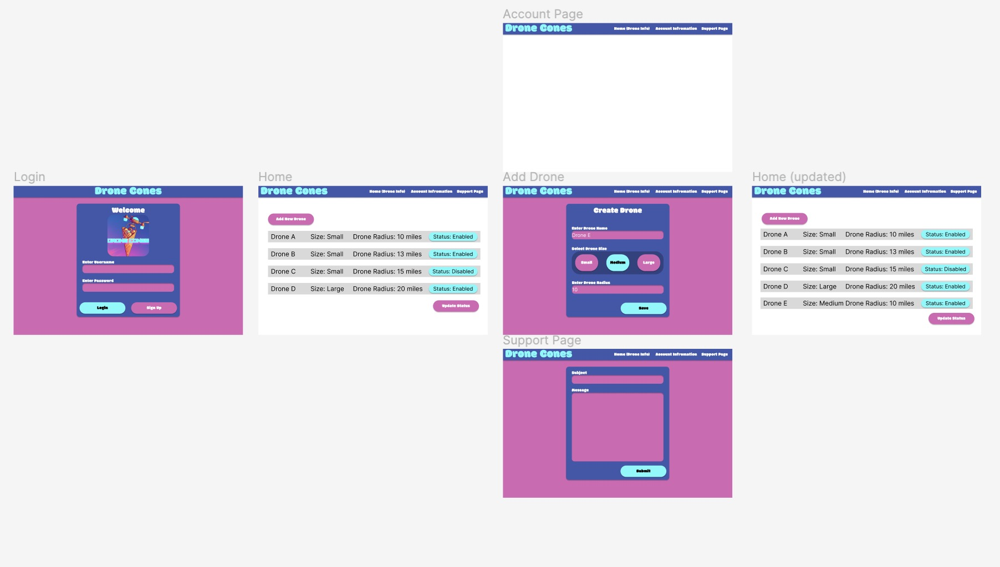
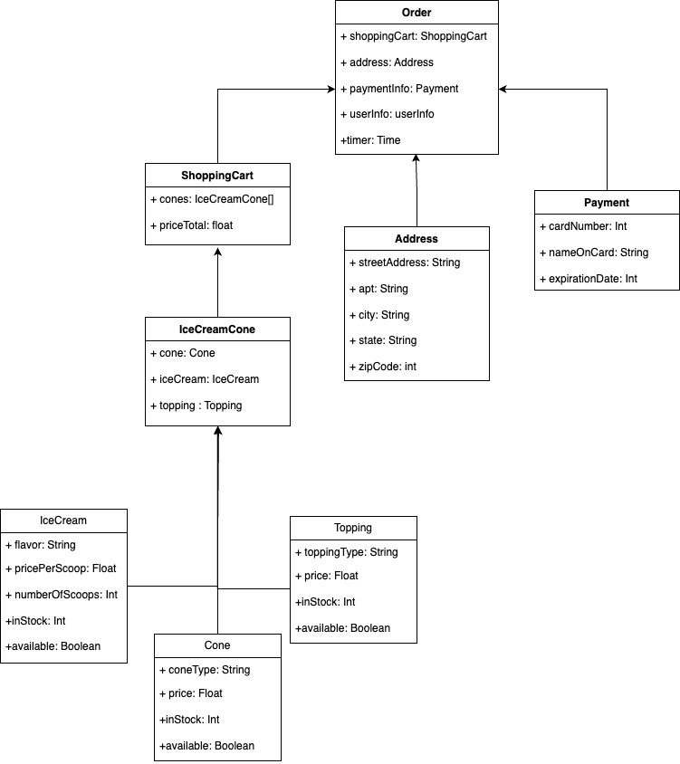

# Drone Cones Low Level Design

## UI Design

* A new user creating an account. 
   * Go to the landing page
   * Sign up on page
   * Inputs needed to sign up with:
      * Toggle button to decide whether the account is for a customer or drone owner
      * Username
      * Email Address 
      * Password
      * Submit button
* A customer Placing an order 
   * Go to the landing page
      * Enter in Username and password in text fields to login
      * Sign-in button
   * Have a menu bar that has the following pages to toggle between:
      * Account information
      * Make an order (i.e., the default home page for)
      * Support page
      * Shopping Cart (i.e., the page to show items one is wanting to order)
   * Go to the make an order page
      * Make an order page
         * A list of past orders with a onclick ability to make it their order if they desire
         * On the page there will be three ice cream flavor options put as buttons to click to choose an order
         * On the page there will be number of scoop options put as buttons to click to choose an order
         * A list of toppings with an onclick capability to put with order
         * Add to cart button to save order of one ice-cream cone which will submit the order to the shopping cart page and refresh the page
   * Shopping Cart page
      * Displays the list of cones about to be ordered by you
      * Next to each cone there will be an option to specify how many of that order to make (i.e., A plus or minus button will do this)
      * There will also be a remove item from cart button next to each cone order
      * There will be a text box for the address to deliver it to
      * Next to the text box for the address have a button that when clicked saves address for future orders to the costumers account. There will be a default address preprogrammed in if the user has already saved there address to the account that can be overwritten by just simply backspacing and writing a new address.
      * A few text boxes for payment information
         * Name on card
         * Date of expiration on Card
         * Card Number
         * Security Code
      * Next to payment information there will be a button that when clicked saves information for future orders to the costumers account. There will be a default payment information preprogrammed in if the user has already saved there payment information to the account that can be overwritten by just simply backspacing and writing new payment information for each of the text boxes. (Maybe implement on 2.0 but a little unnecessary to save information for default input later)
      * Display prices
         * How much for each item in order
         * Tax
         * How much for the total order
      * A place order button that places the order
      * A list of most recent order status
         * Placed
         * Ready
         * In transit (have a default timer timer to change it from transit to devlivered after 8 min)
         * Delivered
   * Account Information Page
      * We see this as redundant so we might delete this page for the customer since the address and payment information can be changed and viewed in the shopping cart page?? Do we need to save credit card info and addresses? Ask Erik? (maybe we’ll just implement it for fun)
   * Support page
      * A text field to write out what you want support with
      * Submit help button which when clicked with say form submitted on a new page it will take you to (i.e., the admin will respond to questions to the email they put when signing up)
* Drone owner:
   * Go to the landing page and input Username and Password into the text fields to access account
      * Click the login button on the landing page which will take them to the main page of the software
   * The main page that has a menu bar with the following links:
      * Account information 
      * Drone information (i.e., default main page for drone owners)
      * Support page (if the app is not working how they want)
   * Drone information Page
      * Add new drone button
         * Once button a form a will open for new drone information. This form contains:
            * Name: identifier for the drone owner in a text field
            * Size: (small - 1 cone, medium - 2 cones, large - 4 cones) with a drop down menu of the three sizes of drones
            * Upload drone button
      * List of all the drones
         * Each drone will list their total revenue made, their size, and their status
         * On each drone there is an edit button that will take the user to a new menu
            * The menue will have the following options
              * Change the size of the drone between the three sizes specified
              * Change the name of the drone
              * Change the status of the drone between enable, disable and delete
   * Account information page
      * Total revenue in app
        * Bank information form:
          * Routing number text field
          * Account number text field
          * Submit button to save changes and begin the transfer
   * Support page
      * Same as the one for the customers

* Manager Viewpoint
   * Go to landing page 
      * Landing page 
         * Username Textbox
         * Password Textbox
         * Login button which takes you to the home page when clicked
      * Home page
         * Has a menu bar with links to the different pages
         * Menu bar
            * Inventory page (i.e., Home page default)
            * Support form page 
            * Account page
         * Inventory page
            * Next to each type of ice-cream cone, flavor, and topping, there will be an order button with a drop-down menu of number of items wanting to be orders you can specify. When clicked this charge your bank account and order it (i.e., it will use the bank account specified in the account page)
            * Cone types
            * Ice-cream flavors
            * Toppings
            * Orders status
               * List of orders placed with their accompanying status.
               * Status of orders will be one of the following
                  * Placed
                  * Fulfilled
               * Next to each list of orders, we need to have a button that says delete to delete it from the history of orders
               * Next to each list of orders that have only been placed, we need to have a button that says cancel to cancel the order
            * Drones for operation
               * Maybe we need a way to let the manager know when there is not enough drones for 8 minutes between customer orders? Maybe since it’s a class project, we just need to let the drone owner know when there is no drones. () 
         * Account page
            * Manger bank information text form 
               * Bank information text form will be default to the last bank specified which can be undone by just backspacing.
               * Bank information text form fields:
                  * Routing number
                  * Account number
            * Revenue from app in graph forms
               * Graph form includes:
                  * Revenue per last year
                  * Revenue total since it began
         * Support form page
            * See all the customers questions or feedback with email and username on it (i.e., which is pulled from the database by default without the user pulling that information). Each customer question or feedback will have a resolved button that you can click to resolve it the comment will be displayed as resolved.

## Classes Design

### Pages needed with components needed for each page
#### All Users
* Not logged in Landing page
  * login component that takes you to login page when clicked
  * signup component that takes you to signup page when clicked
* Login page
  * Login component
    * takes in username and password
    * asks if user is a user/manager/drone-provider
* Signup page
  * Signup component
    * asks user for name, username, email, password and saves
    * asks if user is a user/manager/drone-provider
    * once signed up, brings back to login page, so they can sign in

#### Users
* Logged in Landing Page
  * menu bar component
    * account settings button
    * order button
    * view menu button
    * sign out button
    * shopping cart button
* View menu page
  * cones component
    * view all different cones
    * cones represented as objects
  * ice cream component
    * view all different ice cream flavors
    * ice cream flavors represented as objects
  * toppings component
    * view all different toppings
    * toppings represented as objects
* Order menu
  * cones component
    * add a cone to order
    * price of cone
    * grey out cone if none of that one is available
  * ice cream component
    * add ice cream flavor to order
    * price of different amounts of scoops for ice cream flavor
    * grey out flavor if none of that flavor is available
  * toppings component
    * add topping to order
    * price of topping
    * grey out topping if not available
  * add order component
    * adds current order to shopping cart and starts back at beginning of order menu to create next order
  * shopping cart component
    * takes to shopping cart page to view how many items in shopping cart
* order placed, time estimate page
  * time reduction component
    * notifies user when order is placed, order is on its way, order is there
* Shopping cart page
  * cart component
    * displays cart
  * user card info component
    * user enters card info

#### Managers
* Support page
	* Ticket component
		* See all support tickets
		* Archive ticket button
* Stock page
	* Current stock component
		* All flavors and how many scoops they have.
	* Update stock component
		* All ice cream flavors with text boxes defaulting to 0. 
		* Submit button, calls to the database ADDing all the new scoops
* Landing page

#### Drone Providers
* Drone managment page
	* Add new drone component
		* on click, open form and ask for size drone radius and a submit button. 
	* List of all drone component
		* Drone class
		* *** do something like has drop down with enable and delete, save button at b ***
		* Save button to save drone changes.
* Account information page
	* Revenue Component
	* Bank transfer component
		* Form with bank info.
		* Button to transfer.
		

### Classes
* ice cream class
  * information:
    * flavor: string
    * pricePerScoop: number
    * number of scoops: number
    * amount: number
    * available: boolean
  * Used in components:
    * view menu component
    * order component
    * shopping cart component
* topping class
  * information:
    * topping: string
    * price: number
    * amount: number
    * available: boolean
  * Used in components:
    * view menu component
    * order component
    * shopping cart component
* cone class
  * information:
    * cone: string
    * price: number
    * amount: number
    * available: boolean
  * Used in components:
    * view menu component
    * order component
    * shopping cart component
* ice cream cone class:
  * information:
    * cone: cone
    * ice cream: ice cream
    * topping?: topping *optional
    * ice cream cone price: number
  * Used in components:
    * order component
    * shopping cart component
* shopping cart class:
  * information:
    * ice cream cones: ice cream cone[]
    * all ice cream cones price: number
  * Used in components:
    * shopping cart component
* order class:
  * information:
    * shopping cart: shopping cart
    * address: address/string
    * card information: card info/string
    * user info: user info
    * timer: time
  * Used in component:
    * order place/timer component
    * card info component
* drone class:
  * information:
    * size: number
    * owner: string
    * available (owner allows to be used or not): boolean
    * in use (order is being fulfilled or not): boolean
    * timer: time
  * Used in components:
    * drone management page/add new drone and list all drone components

### UML

## Database Design

### Users

UserType:

| ID     | UserType   |
| ------ | ---------- |
| 0      | Customer   |
| 1      | DroneOwner |
| 2      | Manager    |

Users:
*   id (primary) (uuid)
*   usertype (0,1,2)
*   username
*   firstname
*   lastname
*   email
*   banned

| id                                   | usertype | username   | firstname | lastname | email                   | banned |
| ------ | -------- | ---------  | --------- | -------- | ----------------------- | ------ |
| d1b045f7-990b-45e6-be1a-b9bc2381ca6d | 0        | jbuchanan  | James     | Buchanan | jamesbuchanan@gmail.com | False  |
| 2734a4da-0402-42e9-95f7-d4deb621c2a0 | 2        | erik.falor | Erik      | Falor    | erikfalor@hotmail.com   | False  |
| b821ce8d-2ce4-4625-9d12-dc49dab5e103 | 1        | ambrown    | Amanda    | Brown    | abcdefg@hotmail.com     | False  |

Addresses:
*   id
*   user_id (uuid)
*   country
*   city
*   state
*   zipcode
*   street_address
*   apt_num

| id | country | city       | state | zipcode | street_address | apt_num | userID                               |
| --------- | ------- | ---------- | ----- | ------- | ------------- | ------ | ------ |
| 0  | U.S.    | Logan      | UT    | 84321   | 123 E 456 N    | 4       | d1b045f7-990b-45e6-be1a-b9bc2381ca6d |
| 1  | U.S.    | Smithfield | UT    | 84335   | 999 S 200 E    | NULL    | b821ce8d-2ce4-4625-9d12-dc49dab5e103 |

### Transactions

Transactions:
*   id (primary)
*   user_id (uuid)
*   Price before tax
*   Tax
*   Final price
*   ItemCount
*   order time
*   Completed

| id | user_id                              | sales_price | tax  | final_price | item_count | order_time                 | completed |
| ------------- | ------------------------- | ----------- | ---- | ----------- | ---------- | -------------------------- | --------- | 
| 0  | b821ce8d-2ce4-4625-9d12-dc49dab5e103 | 9.14        | 1.13 | 10.27       | 2          | 2023-10-13 17:07:35.994024 | True      |
| 1  | b821ce8d-2ce4-4625-9d12-dc49dab5e103 | 4.56        | 0.33 | 4.89        | 1          | 2023-10-13 17:07:35.994024 | True      |

OrderItem:
*   ID (primary)
*   TransactionID
*   Cone Type
*   Ice cream flavor
*   Topping
*   Scoop count
*   Price

| id | transaction_id | cone | flavor1 | flavor2 | flavor3 | topping | scoops | price |
| -- | -------------  | ---- | ------- | ------- | ------- | ------- | ------ | ----- |
| 0  | 0              | 0    | 1       | 1       | 0       | 1       | 2      | 5.25  |
| 1  | 0              | 1    | 1       | 1       | NULL    | NULL    | 1      | 3.89  |
| 2  | 1              | 0    | 0       | NULL    | NULL    | 0       | 2      | 4.56  |

ItemsInProgress
This table is the same as OrderItems except in includes a user_id instead of transaction_id. This is to store items currently in a users cart.

DroneDelivery:
*   ID (primary)
*   TransactionID
*   DroneID

| id | transaction_id | drone_id |
| -- | -------------- | -------- |
| 0  | 0              | 1        |
| 1  | 1              | 0        |

### Stock

Stock (Cones, Flavors, Toppings):
*   ID (primary)
*   Name
*   Amount
*   Available
*   Price / Price per Scoop
*   Image URL

Cones:
| id | name   | amount | available | price | image |
| -- | ------ | ------ | --------- | ----- | ----- |
| 0  | Sugar  | 25     | True      | 100   | NULL  |
| 1  | Waffle | 13     | True      | 100   | NULL  |

Flavors:
| id | name       | amount | available | price_per_scoop | image |
| -- | ---------- | ------ | --------- | --------------- | ----- |
| 0  | Vanilla    | 98     | True      | 400             | NULL  |
| 1  | Chocolate  | 56     | True      | 400             | NULL  |
| 2  | Strawberry | 0      | False     | 400             | NULL  |

Toppings:
| id | name       | amount | available | price | image |
| -- | ----       | ------ | --------- | ----- | ----- |
| 0  | Hot Fudge  | 33     | True      | 100   | NULL  |
| 1  | Caramel    | 12     | True      | 100   | NULL  |

RestockHistory
*   Id
*   Created at
*   type
*   cone
*   flavor
*   topping
*   amount
*   status

| id | created_at                 | type | cone | flavor | topping | amount | status |
| -- | -------------------------- | ---- | ---- | ------ | ------- | ------ | ------ |
| 0  | 2023-10-13 17:07:35.994024 | cone | 1    | NULL   | NULL    | 50     | placed |

### Drones

DroneSize:
*   Id
*   Count

| id | count |
| -- | ----- | 
| 0  | 1     | 
| 1  | 4     | 
| 2  | 8     |

Drones:
*   DroneID (primary)
*   Owners UserID (uuid)
*   Name
*   Size (small, medium, large)
*   Available
*   In Use
*   Last Delivery

| id | owner_id                             | name         | size | available | in_use | last_delivery       |
| ------- | ------------------------------- | -----------  | ---- | --------- | -----  | ------------------- |
| 0  | b821ce8d-2ce4-4625-9d12-dc49dab5e103 | MySmallDrone | 0    | True      | False  | 2023-10-20 15:27:21 |
| 1  | b821ce8d-2ce4-4625-9d12-dc49dab5e103 | MyLargeDrone | 2    | True      | True   | 2023-10-20 15:27:21 |

### Support forms

Support forms:
*   formID (primary)
*   UserID  (uuid)
*   formField
*   Resolved
*   Created at

| FormID | user_id                              | form_field                | resolved | created_at          |
| ------ | ------------------------------------ | ------------------------- | -------- | ------------------- |
| 0      | b821ce8d-2ce4-4625-9d12-dc49dab5e103 | The ice cream was late :( | True     | 2023-10-20 15:27:21 |

## Intermediary functions
Here are the function signatures for various functions that will interact with the database system, in order to abstract our use of Supabase as well as standardize our database queries.

### Users
There is no addUser function. A row is added to the user table simulaneous to the use of Supabase's auth signup function through sql function.

getUser(userID: string)
*   returns the row with given userID as a user object

updateUser(userID: string, userUpdate: User object)
*   updates the row of user database with given UserID, changing the columns that are specified in userUpdate

toggleUserBan(userID: string)
*   toggles the banned column of the user with userID

getUsers(userType: number = None)
*   returns a list of all user in database as user objects. If a UserType is specified, it only returns those types of users

addAddress(userID: number, Country: Str, City: Str, State: Str, ZipCode: Str, StreetAddress: Str, Apartment: Str = None)
*   Adds a row into address database with given information

getUsersAddress(userID: number)
*   returns the row from address database associated with the given userID, currently only returns the first address

### Transactions
addTransaction(transaction: Transaction object, droneIDS: number[])
*   Adds a new row to transaction database with the data in transaciton object,
*   Adds new rows to drone deliveries database for each droneID in droneIDs
*   Adds new rows to soldItems database, for each item in the items list

getTransactions()
*   returns all transactions in database

getUserOrderHistory(UserID: string, limit: number = 3)
*   returns all transactions tied to given UserID, including all items in the order. 
*   If limit is specified, it returns that many, otherwise returns three most recent

getTransaction(transactionID)
*   returns transaction with given transactionID as a transaction object

addItemInProgress(item: ItemInProgress object)
*   adds the specified item into the itemsInProgress table

getItemInProgress(itemID: number)
*   returns the itemInProgress with specified itemID from database

removeItemInProgress(itemID: number)
*   deletes the itemInProgress with specified itemID from the database

getUsersItemsInProgress(userId: string)
*   returns a list of all itemsInProgress with the given userID

removeUsersItemsInProgress(userID: string)
*   deletes all itemInProgress rows with the given userID from the database

addAllSoldItems(userId: string, transactionID: number)
*   Retrieves all itemsInProgress for the given userID
*   For each one, it calls addSoldItem, passing in the given transaction id, and updates the stock of those items
*   calls removeUsersItemsInProgress to delete those items

addSoldItem(TransactionID: Int, item: OrderItem object)
*   adds a new row in Sold Items database with given information

updateStock(item: OrderItem)
*   Goes through each part of the OrderItem and reduces the amount of each by 1

addDroneDelivery(TransactionID: Int, DroneID: Int)
*   adds a new row in DroneDelivery database with given information

### Stock
getCones()
*   returns all cones in database as a list of Cone objects

getCone(ID: Int)
*   return cone with given ID as a Cone object

addNewCone(Name: Str, Amount: Int, price: number, Available: Bool = True)
*   add a new row into cone database with given information

addConeAmount(ID: Int, Amount: Int)
*   adds the amount given to the amount of the cone with given id

useOneCone(id: number)
*   reduces the amount of the given cone id by 1

toggleConeAvailability(ID: Int)
*   update the Available column of cone with given ID to opposite boolean value

removeCone(ID: Int)
*   Remove cone with specified Id from database

updateCone(id: number, cone: Cone object)
*   Updates the cone with the given id with any information in cone

uploadConeImage(image: any)
*   uploads a image to a 'stockImages' storage bucket at path of 'cones/' 

restockCones(items: [])
*  makes a restock order for each item in the list

The above functions will also exist for the Flavors and Toppings database tables.

makeRestockOrder(type: string, item: any)
*   Makes a restock order for the proper table of type 'cone', 'flavor' or 'topping'
*   Inserts a row into RestockHistory table
*   Starts development timer that changes status from 'placed', to 'shipped', then 'completed'
*   Updates the amount of that item

getRestockHistory()
*   Returns a list of all rows in restockHistory table

### Drones

getDrone(DroneID: Int)
*   return drone from database with given DroneID as drone object

addDrone(UserID: Int, Name: Str, Size: Int?, Available: Bool = True)
*   adds a new drone to database

removeDrone(DroneID: Int)
*   Removes drone with given DroneID from database

toggleDroneAvailability(DroneID: Int)
*   Set the Available column of drone with DroneID to the opposite boolean value

editDrone(id: number, drone: Drone object)
*   update the drone with given id, only need to pass information that's changed, but can pass all

getDrones(UserID = None, limit: number = 10)
*   Returns a list of drone objects with all information about those drones
*   The limit argument will determine how many drones to return, defaults to 10
*   If userID is not given, it will return a slist of all drones,
*   If userID is given, it will only return drones with that user as the owner

getDeliveryDrones(Count: Int)
*   This function will return a list of droneIDs that can carry a delivery of count number of cones
*   If the function returns null, then there are not enough drones to carry the delivery, and it must be tried again or added to a queue

availableDroneCount()
*   Returns the number of currently available drones

getDroneDeliveries(TransactionID: Int = None, DroneID: Int = None)
*   returns drone deliveries from database
*   if TransactionId is specified, only return droneDeliveries with that TransactionID
*   if DroneID is specified, only return droneDeliveries with that DroneID

### Support Forms
addForm(UserID: string, FormField: Str)
*   adds a new support form to database

getForms(limit: number, includeResolved: Bool)
*   Return a list of forms, from the database
*   it argument determines the max number of forms to return
*   includeResolved argument will determine if forms that have been resolved are returned or not

toggleFormResolved(formID: number)
*   toggles the resolved boolean for the support form with given formID

