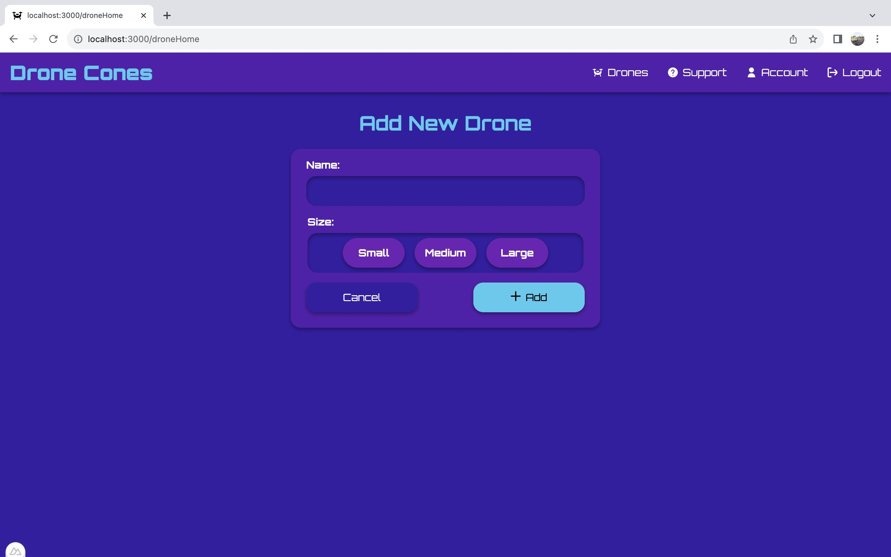
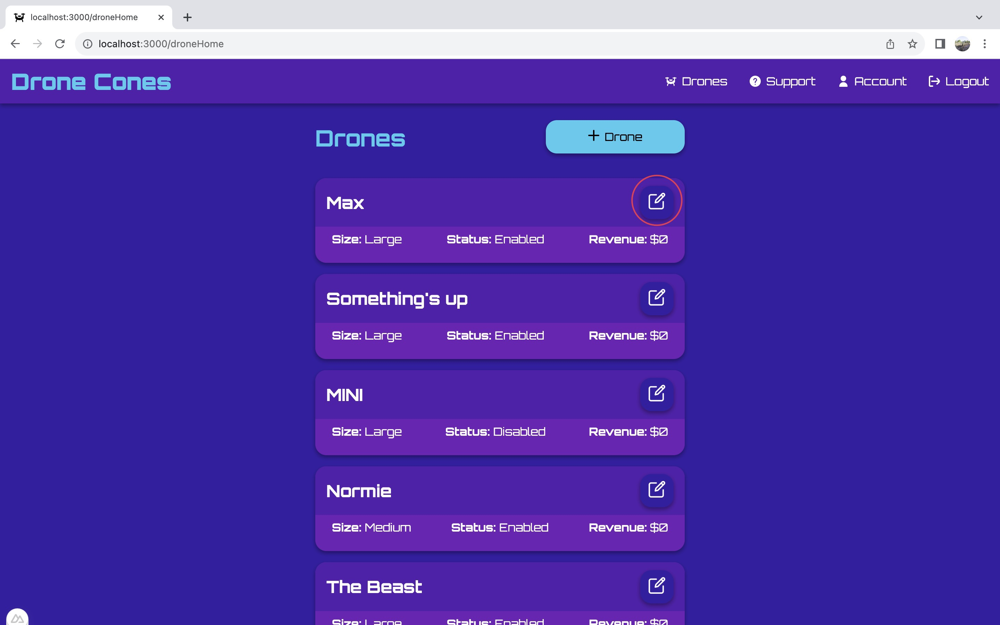
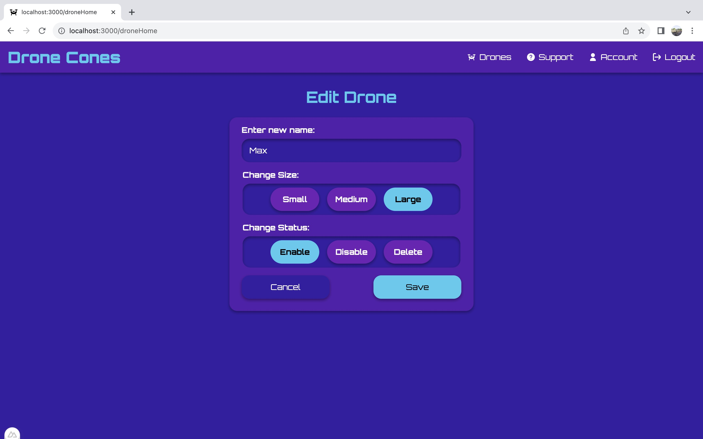
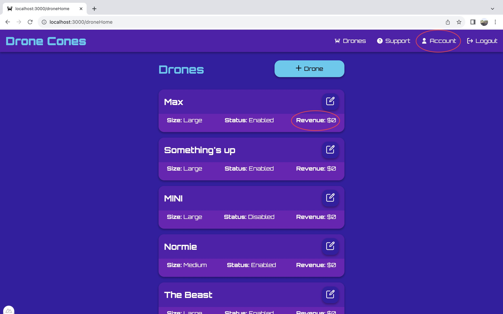
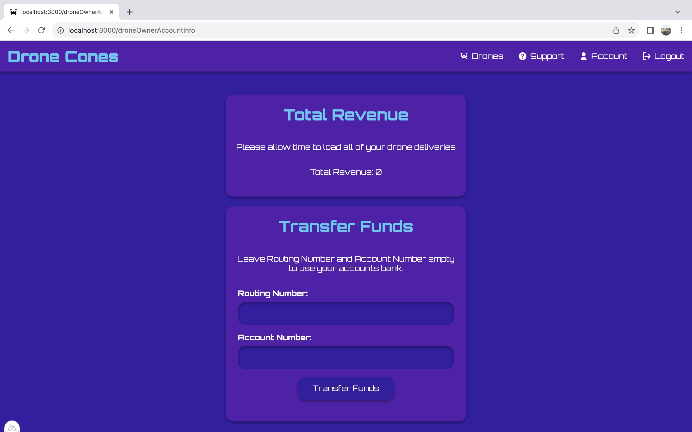

# Drone Owners

## Adding a Drone
* On the your homepage click the button on the upper right of the page labeled "+ Drone." This will open up a new menu.

* Once inside the Add New Drone menu, there are a few inputs displayed.

    1. The name textfield is where the name of the new drone is specified.
    2. There are then three options for the size of the drone, small, medium, and large. Small means the drone can carry one cone, medium the drone carries two cones and large means the drone can carry up to four cones.
* At the bottom on the menu there are two buttons. The one on the left cancels and returns to the home page. The Add button adds the new drone with the name and size specified to the database and returns to the home page.
* One thing to note is that the default status is set to enabled.

## Editing a Drone
* On the homepage click the edit button in the upper right corner of the desired drone to edit. This will open up a new menu.

* Once inside the Edit Drone menu, there are a few inputs:

    * There is a textbox to enter a new name for the drone
    * There are options for changing the size of the drone
        * Small - carries 1 cone
        * Medium - carries 2 cones
        * Large - carries 4 cones
    * There are options for changing the status of the drone
        * Enable - makes drone available for deleveries
        * Disable - makes drone unavailable for deleveries
        * Delete - removes the drone from the database and the list
* At the bottom of the menu there two buttons. The one on the left cancels and returns to the home page. The Save button saves the drone edits and updates the stored values in the database, then returns to the homepage.

## Viewing and Managing income
* On the homepage, for each drone there is an amount listed by the Revenue keyword telling the income the individual drone has made.

* To view total income click on "Account" in the navbar at the top of the page(or inside the side menu). This will redirect to the account page.

* At the top under Total Revenue the total income is listed for all drones
* Under Transfer Funds there is an option to enter banking information like Routing and Account numbers. To transfer funds to a bank enter the corresponding information and then click on the "Transfer Funds" button at the bottom of the page. The result will be a transfer, thus setting the income balance to zero.
* To go back to the homepage click on "Drones" in the menu bar.

## Support
* If you run into any issues click on support in the navbar (or menu) to send a message to one of our managers.