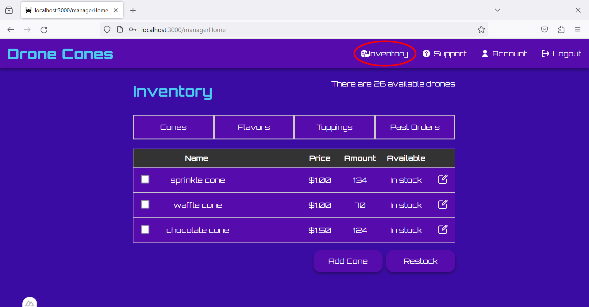
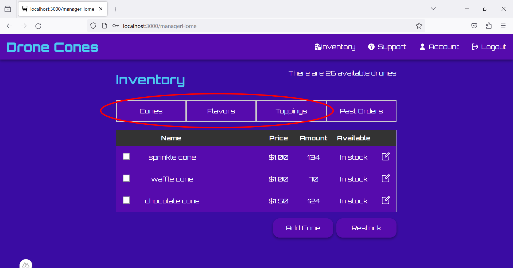
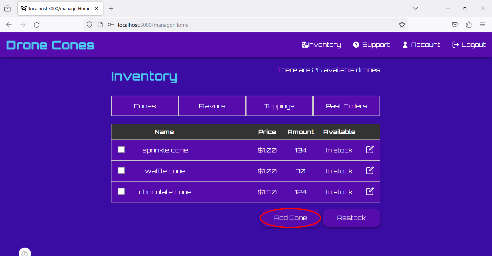
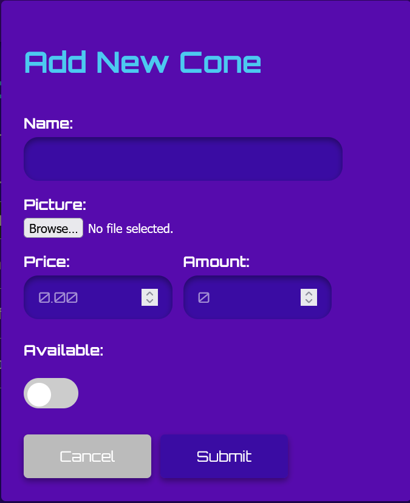
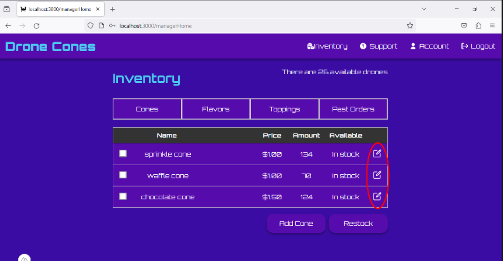
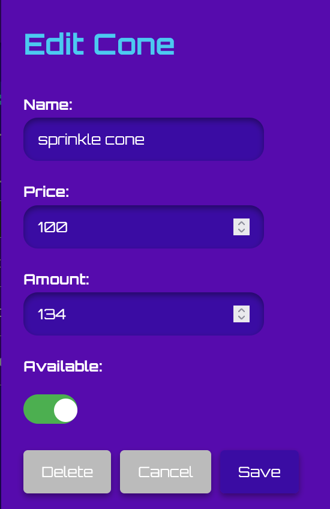
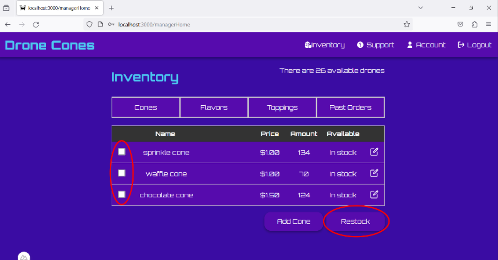
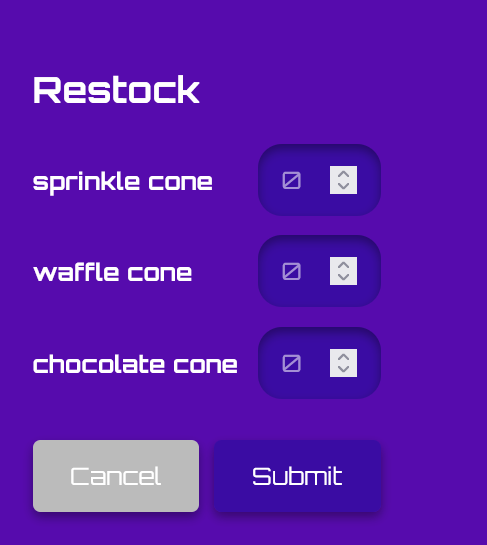
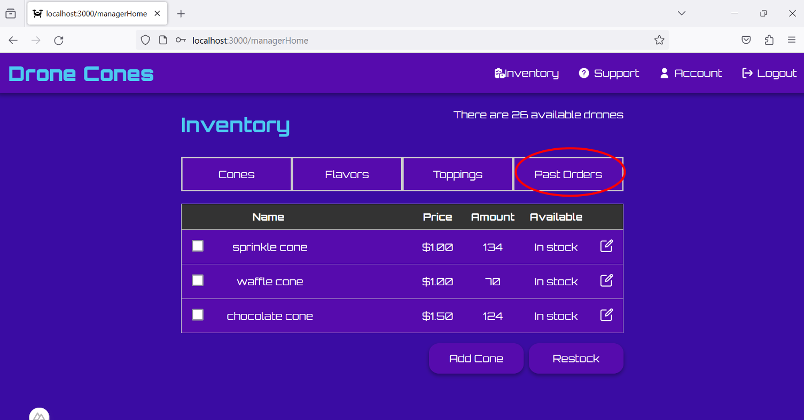
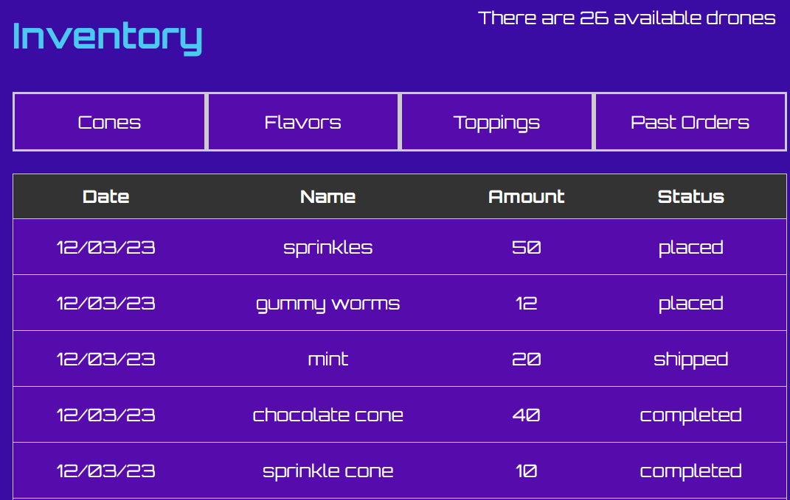

# Managers

## Viewing Inventory
* Once logged in, you are automatically redirected to the inventory page.
* The inventory page can also always be reached through the "Inventory" button in the top navigation bar.

*   Once on the inventory page, you can view the different item types: Cones, Ice cream flavors and Toppings by choosing on of the buttons above the table

## Adding New Items
*   To add a new item, navigate to the table for the corresponding item type. Then click the "Add Item" button below the table. This will open up a new menu.

*   Inside this menu, there are a few inputs:

    *   There is a textbox for the name of the new item
    *   A file select for the picture that will be used for the item. 
        *   The image you select must be either a png, jpeg, or gif.
    *   An input for the item's price
    *   An input for how many you already have, if any.
    *   And a toggle for whether or not the item is currently available
*   At the bottom of the menu, there are two buttons. On the left, there is a cancel button that returns to the inventory page. On the right is the submit button. Once you've filled out all the information above, hit submit, and the new item will be created.

## Editing Items
*   To edit an existing item, navigate to that item in the table. On the right side of that items table entry, there is an edit button, shown below. Click on this button, which will open up a new menu.

*   There are a number of inputs in this menu, which show the items current information.

*   It shows the items name, price, current amount and availability. Change any or all of these as desired.
*   Along the bottom, there are three buttons.  
    *   The left button will delete the item. Take care to only use this when you are sure, as it can't be undone. 
    *   The middle button is a cancel button that will return you to the inventory page.
    *   The right button is the save button. Once you've made any desired changes, click this button, and the changes will be saved, and will appear in the inventory table.

## Restocking Items 
*   To make a restock order, navigate to the item table where you would like to restock.
*   On the left of each item in the table is a checkbox, shown below in the left circle. Check all items you would like to restock
*   Once you've selected everything, click the "Restock" button below the table, also circled below. This will pull up a new menu.

*   In this menu, there is an entry for each item that was selected. Input the amount you would like to order in each corresponding input box.
*   Below these rows, there are two buttons,
    *   The "Cancel" button, that will return to the inventory page.
    *   The "Submit" button, that will place the restock order for you.

*   You can view both current and past restock orders by clicking the "Past Orders" button, shown below

*   This page will show the relevant information for all orders you've made including
    *   The date the order was placed
    *   The item that was ordered
    *   The amount that was ordered
    *   The order status.
*   Order status has four different statuses
    *   "placed" when the order has been placed, but not yet shipped.
    *   "shipped" once the order has been sent out for delivery.
    *   "completed" once you have recieved the order.
    *   "canceled" if the order was canceled for any reason.

