# The Order Page

## Creating an Order
* Once logged in, if you are a regular user and not a drone owner or manager, you will be directed to the Ordering page.
* The Ordering page can also be accessed through the navigation bar at the top of the page.
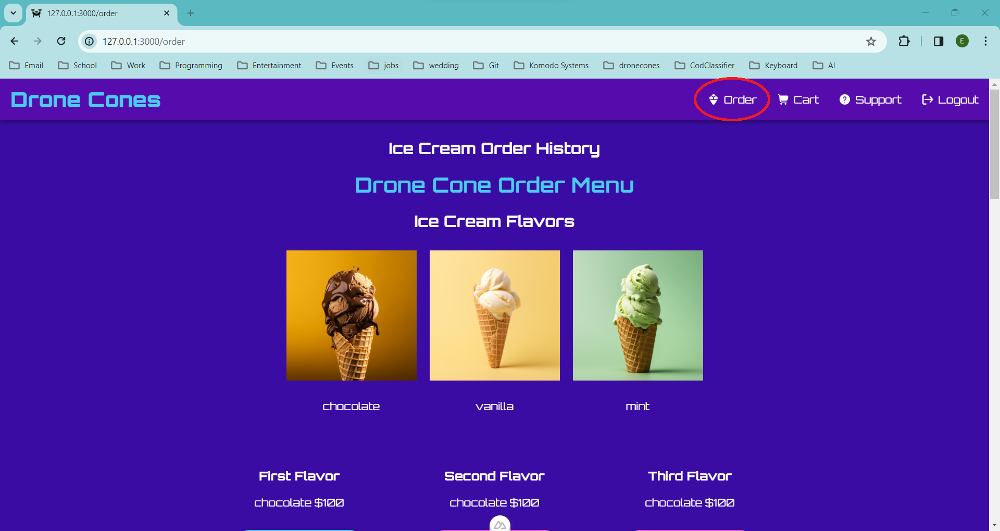 
* From the ordering page, we can then fill out an order by choosing ice cream flavors, cone, and toppings.
* If a button for a flavor/topping/cone is pink, this would indicate that either an item is out of stock or (in the case of scoops) you have yet to choose a first or second flavor of ice cream. In order to choose a second or third ice cream scoop, you must choose a first and second scoop.
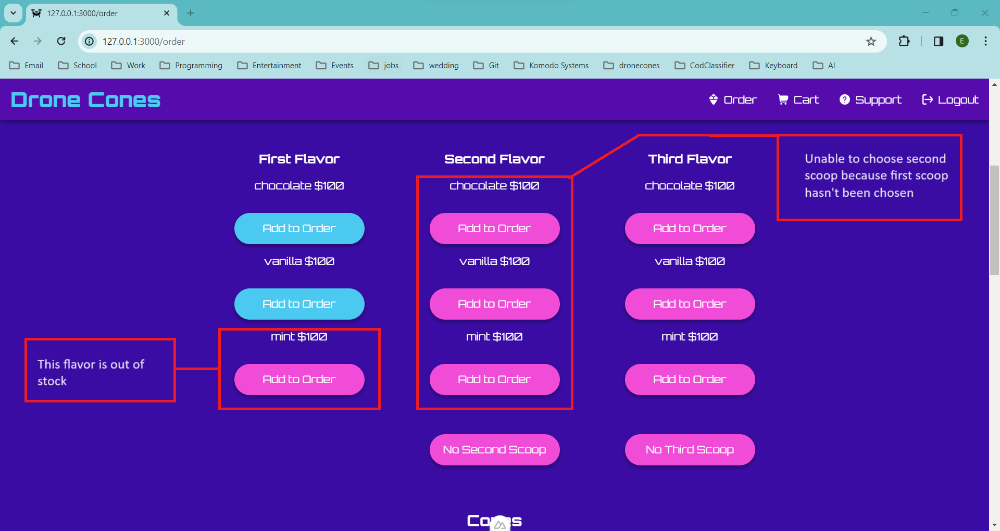 
* There is also an option if you accidentally chose a second or third flavor and decide you do not want a second or third flavor to remove those scoops from your order. If you press the second flavor's "No Second Scoop" button, this will result in clearing the Second and Third flavor from your order
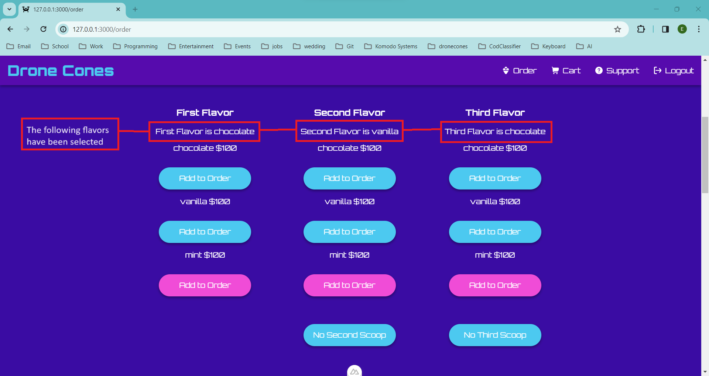 
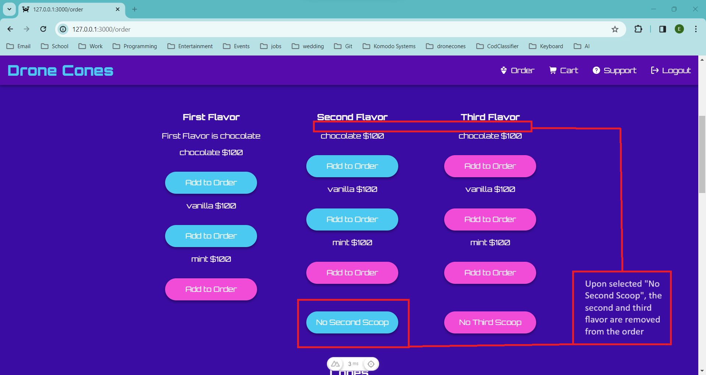 
* The user can pick 1 to 3 scoops for their ice cream cone in any flavors that are available (indicated by blue buttons).
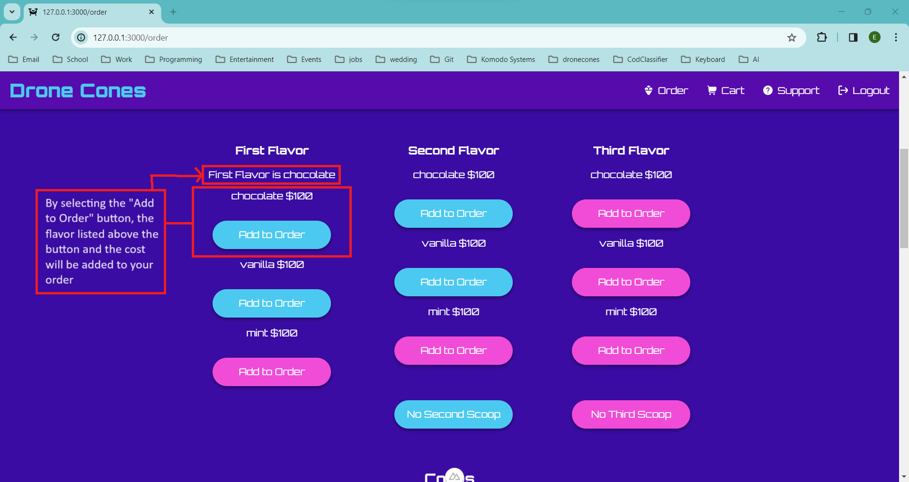 
* Once ice cream scoops have been selected, you are able to add a cone and topping. The cone and the First flavor of ice cream are the only requirements for creating an order, while the Second and Third flavor as well as the topping are optional.
* The cone and topping can be selected in the same way as the First scoop of ice cream, by selecting the "Add to Order" button below the name of the cone or topping.
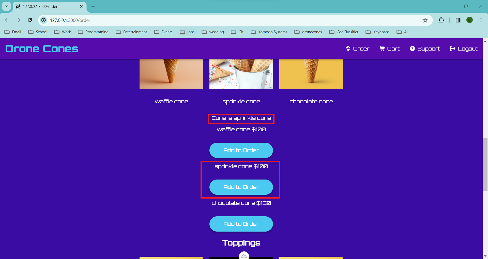 
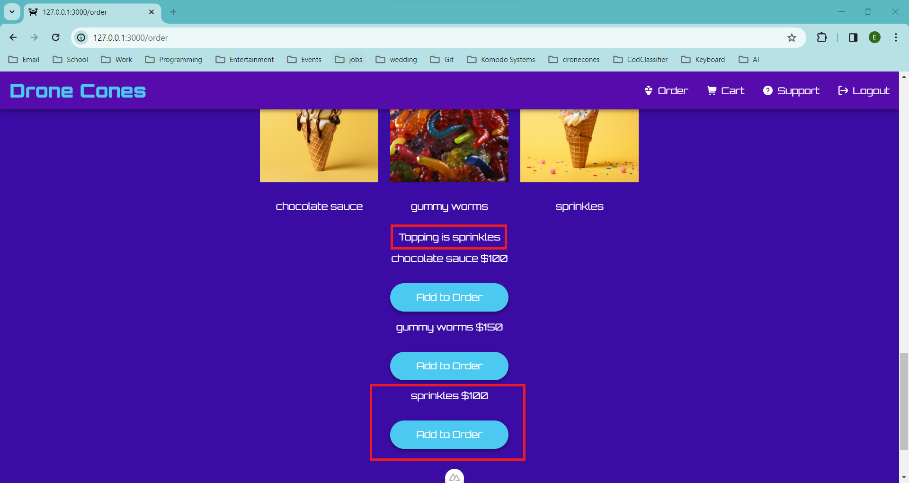 
* If a first scoop of ice cream or a cone has not been selected, the "Add to Cart" button will remain pink (unable to add order to cart) until both are selected. Once they have been selected, the button will turn blue and you may add your order to the cart.
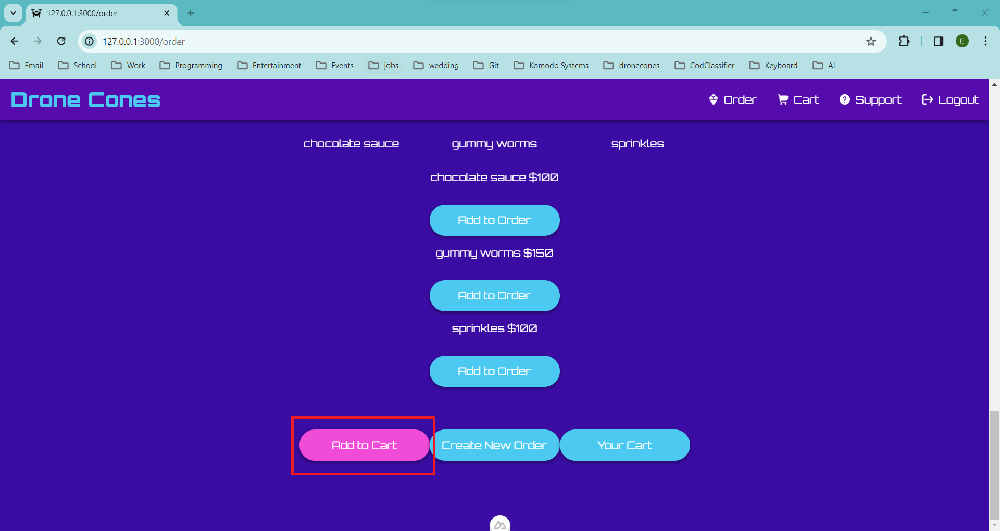
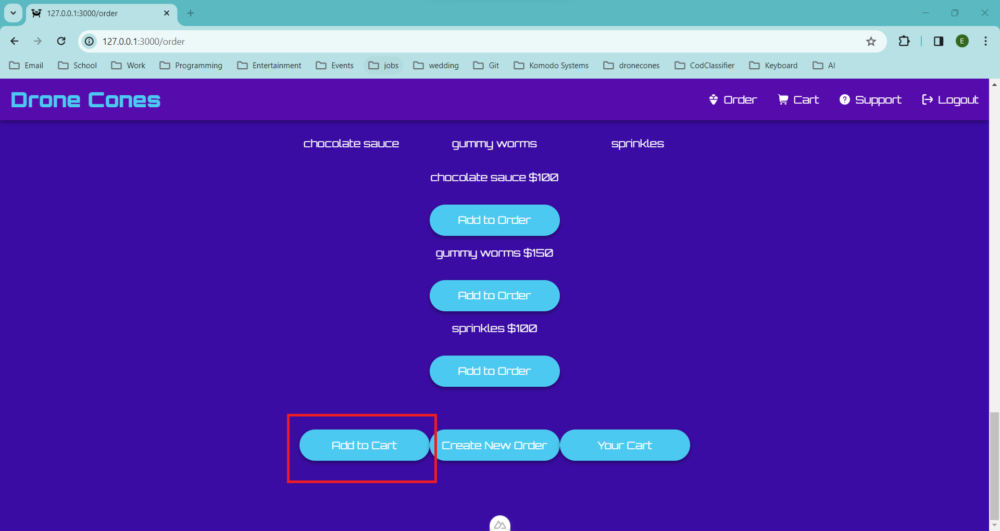  
* To view the cart and complete the transaction you may press the "Your Cart" button at the bottom of the page or the "Cart" button in the Navigation bar at the top of the page.
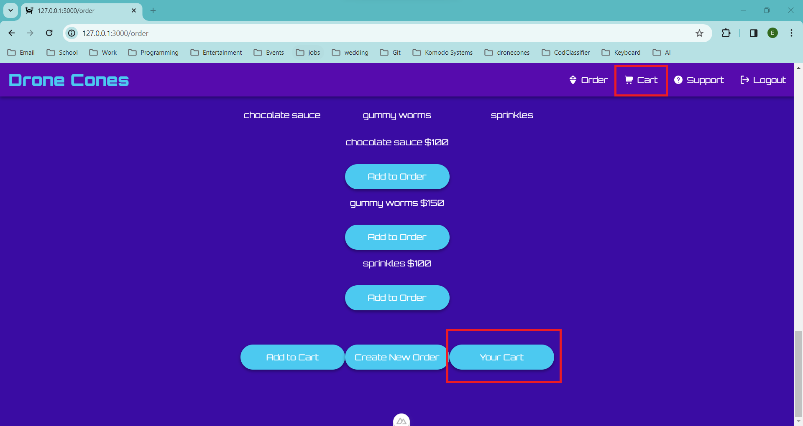 
* If you would like to make another order, you can press the "Create New Order" button at the bottom of the Ordering page or the "Order" button in the Navigation bar at the top of the page.
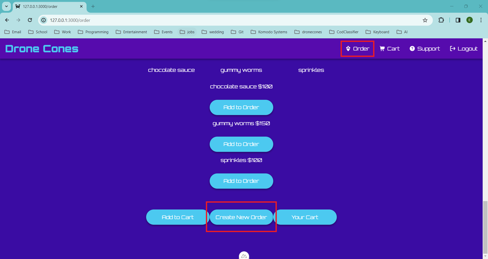 