# DroneCones Users Manual
* [Overview](#drone-cones)
* [Installation Instructions](#installation-instructions)  
* [Getting Started](#getting-started-with-drone-cones)
  * [Customers](#customer-edition)
  * [Drone Owners](#drone-owners)
  * [Managers](#managers)
* [Ordering](#the-order-page)
* [Troubleshooting](#troubleshooting)
* [Frequently Asked Questions](#frequently-asked-questions)
* [Contact Information](#contact-information)

# Drone Cones
Welcome to Drone Cones! Drone Cones is a service to make some extra cash with your drone or to order some icecream like never before, BY DRONES! 

## Customer
Want to order some icecream? Here are some key features when doing so.
* Ordering an icream cone
    * You can order as many as three scoops on one cone each one with their own options for flavors
    * You have a selection of cones to choose from
    * You have a selection to toppings to choose from
* Add you order to your cart
    * You can view and place your order
    * You can enter an adress and payment information
    * Finally you can submit your order
If you ever need help or would like to let us know how we are doing click on support and send us a message

## Drone Operator
To make some extra cash rent out your drone. It is as simple as that! Below are a list of the features available to the drone operator.
* Adding a new drone for delivery
* Editing an existing drone
    * You can change the size if you have made some upgrades to a drone
    * You can change the status either for maintenance or for personal use
    * You can also delete a drone to retire it
* To see the amount of money that you have made head over to the account page. There you can see the amount of money that you have earned and the ability to transfer funds to your bank account.
* If you ever need help or would like to let us know how we are doing click on support and send us a message

## Manager
As a manager you can do the following.
* Manage icecream flavors, cones and toppings
    * Delete the option
    * Update name
    * Change price
    * Update stock
    * Change availablity
* Add new flavors, cones and toppings
    * Give the option a name
    * Upload a photo
    * Enter price, and the amount available
    * Mark as available
* Restock items
    * Select the items to restock and then press restock and enter the amounts ordered.
* View past orders
* View and manage support messages
    * Mark them as resolved

<br>
<br>
<br>

# Installation Instructions

## Dependancies 
* Vue.js (must have Vue.js installed)
* Node.js
    * When installing through wizard, go with default settings. Any changes to the default settings may result in issues with Nuxt/causes the installation to be longer than necessary
* Nuxt.js (Nuxt 3)
* pnpm/npm/yarn/bun package manager (preferably pnpm or npm)
* Typescript
* chart.js

## Running Project
* Once all dependencies have been installed, navigate to the apps' directory and run the following in your bash shell:

```bash
# npm
npm install

# pnpm
pnpm install

# yarn
yarn install

# bun
bun install
```
* Then to start the development server, run the following in your bash shell and on a browser navigate to `http://localhost:3000`:

```bash
# npm
npm run dev

# pnpm
pnpm run dev

# yarn
yarn dev

# bun
bun run dev
```
<br>
<br>
<br>

# Getting Started with Drone Cones
## Customer Edition

## Introduction
Hey there, ice cream enthusiasts! Get ready for a scoop of the future with Drone Cones! This guide is your ticket to easy, breezy ice cream deliveries via drone. We'll show you the ropes from setting up to enjoying your favorite flavors delivered right to your doorstep. Say goodbye to the ordinary and hello to the extraordinary—Drone Cones is here to make your ice cream dreams soar. Let's dive into the delicious details and make every delivery a sweet success!

## Getting Started
Depending on what you want to accomplish with Drone Cones, we have different instruction sets. Regardless, what we need to do first is create your account!

## How to make an account
When you come to our landing page, (localhost:3000/) you will be met with a login screen. If you have an account, enter your credentials here. If you need to register for an account, we will click the register button.

You will be taken to a registration page, asking for Username, First name, Last name, Email, Password, and a slider for if you want to register as a drone user. Once you have filled in your credentials, click register. You will be automatically forwarded to the ordering page once your account gets processed!

## How to login
For the purposes of DEMO, use this login
Email: treyson.grange@icloud.com
Password: freeuse 

To login, simply visit our landing page, and input your email and password or the email and password provided above. After logging in, you will be forwar

## Order Ice cream
Once you have logged in, you will have access to our ordering page. There are many options in flavors, cones, and toppings!
First you will see the options for flavors. You are allowed 1-3 scoops of ice cream per scoop. For each scoop, you are allowed 1 of 3 flavors: Chocolate, Vanilla, and Mint. Note that if a option on the ordering screen is pink, that means it is not in stock. 

Once you choose your first flavor, options for your second scoop become available. If you would only like one scoop, you can click "No Second Scoop" and move on! If not, follow the instructions from the first scoop.

Once you have selected all of your flavors, we now get to pick our cones. We have three options at Drone Cones, Waffle cone, Sprinkle cone, and Chocolate cone. Simply click "Add to Order" to make your selection. You will see your currently selected option at the top.

Next comes toppings! At Drone Cones we supply chocolate sauce, gummy worms, and sprinkles. All of which are optional! Choose 1 or none to continue

Now that we have created our Ice Cream cone, we need to add it to our cart. To do so, click 'Add to Cart' underneath the cone creation section. After submitting your order, you can click 'Create New Order' to add another cone, or you can click 'Your Cart' once you are ready to check out!

## Checkout
On the cart page, you will see your cart, including all details for each cone. Underneath, you will see a section where you will be able to enter your payment details. Once done, click order, wait for submission, and wait! 

## Logout
To logout, use the 'logout' button on the top navigation bar. Doing so will bring you to the login page once more. 

## Support
Questions? Need help? Visit our support page! Get in touch by leaving a comment to our managers. You can find the support page on the top navigation bar under Support.

<br>
<br>
<br>

# Drone Owners

## Adding a Drone
* On the your homepage click the button on the upper right of the page labeled "+ Drone." This will open up a new menu.

* Once inside the Add New Drone menu, there are a few inputs displayed.

    1. The name textfield is where the name of the new drone is specified.
    2. There are then three options for the size of the drone, small, medium, and large. Small means the drone can carry one cone, medium the drone carries two cones and large means the drone can carry up to four cones.
* At the bottom on the menu there are two buttons. The one on the left cancels and returns to the home page. The Add button adds the new drone with the name and size specified to the database and returns to the home page.
* One thing to note is that the default status is set to enabled.

## Editing a Drone
* On the homepage click the edit button in the upper right corner of the desired drone to edit. This will open up a new menu.
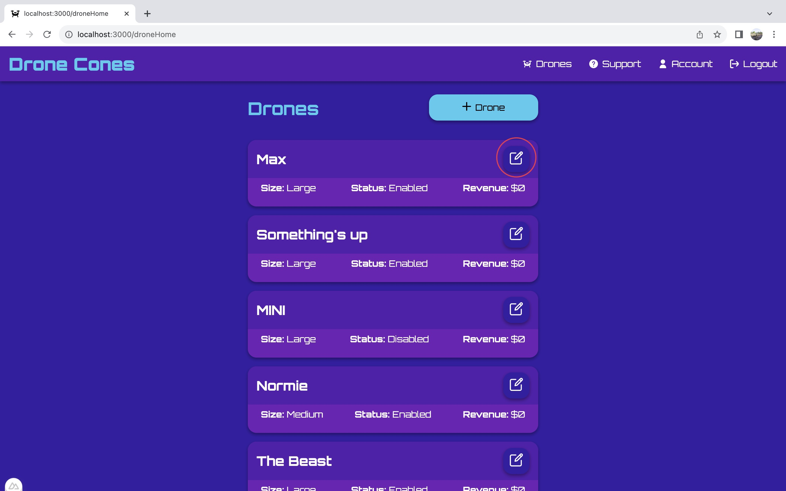
* Once inside the Edit Drone menu, there are a few inputs:
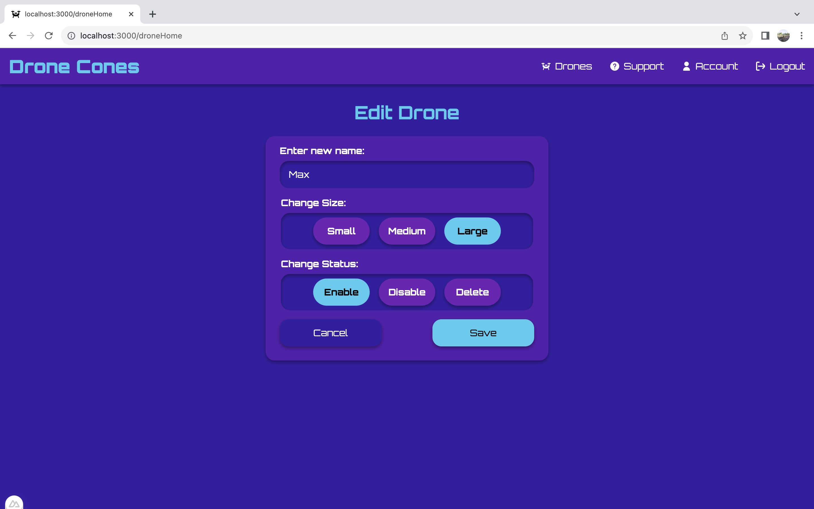
    * There is a textbox to enter a new name for the drone
    * There are options for changing the size of the drone
        * Small - carries 1 cone
        * Medium - carries 2 cones
        * Large - carries 4 cones
    * There are options for changing the status of the drone
        * Enable - makes drone available for deleveries
        * Disable - makes drone unavailable for deleveries
        * Delete - removes the drone from the database and the list
* At the bottom of the menu there two buttons. The one on the left cancels and returns to the home page. The Save button saves the drone edits and updates the stored values in the database, then returns to the homepage.

## Viewing and Managing income
* On the homepage, for each drone there is an amount listed by the Revenue keyword telling the income the individual drone has made.

* To view total income click on "Account" in the navbar at the top of the page(or inside the side menu). This will redirect to the account page.
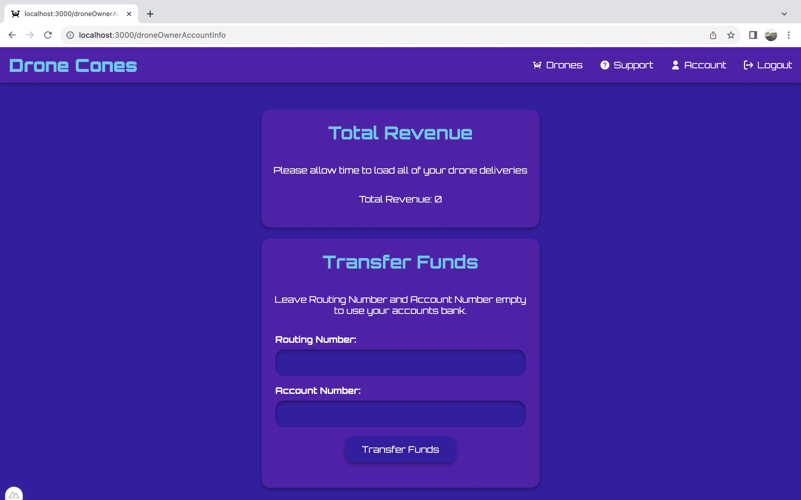
* At the top under Total Revenue the total income is listed for all drones
* Under Transfer Funds there is an option to enter banking information like Routing and Account numbers. To transfer funds to a bank enter the corresponding information and then click on the "Transfer Funds" button at the bottom of the page. The result will be a transfer, thus setting the income balance to zero.
* To go back to the homepage click on "Drones" in the menu bar.


## Support
* If you run into any issues click on support in the navbar (or menu) to send a message to one of our managers.
  
<br>
<br>
<br>

## Managers

## Viewing Inventory
* Once logged in, you are automatically redirected to the inventory page.
* The inventory page can also always be reached through the "Inventory" button in the top navigation bar.

*   Once on the inventory page, you can view the different item types: Cones, Ice cream flavors and Toppings by choosing on of the buttons above the table


## Adding New Items
*   To add a new item, navigate to the table for the corresponding item type. Then click the "Add Item" button below the table. This will open up a new menu.

*   Inside this menu, there are a few inputs:
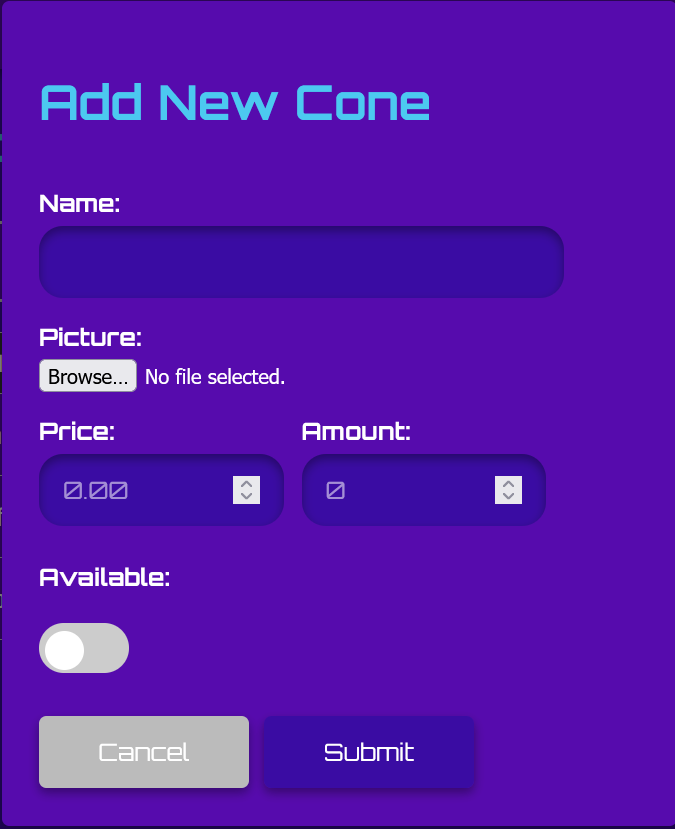
    *   There is a textbox for the name of the new item
    *   A file select for the picture that will be used for the item. 
        *   The image you select must be either a png, jpeg, or gif.
    *   An input for the item's price
    *   An input for how many you already have, if any.
    *   And a toggle for whether or not the item is currently available
*   At the bottom of the menu, there are two buttons. On the left, there is a cancel button that returns to the inventory page. On the right is the submit button. Once you've filled out all the information above, hit submit, and the new item will be created.

## Editing Items
*   To edit an existing item, navigate to that item in the table. On the right side of that items table entry, there is an edit button, shown below. Click on this button, which will open up a new menu.
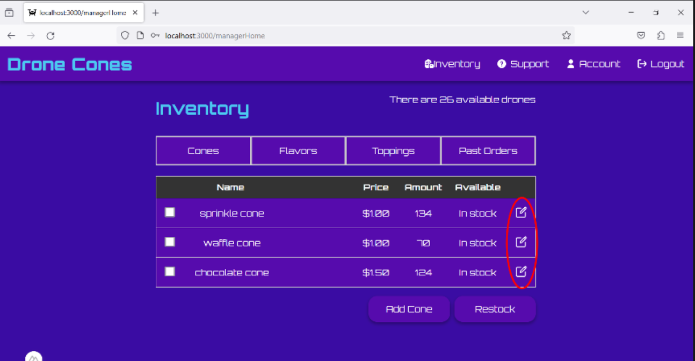
*   There are a number of inputs in this menu, which show the items current information.
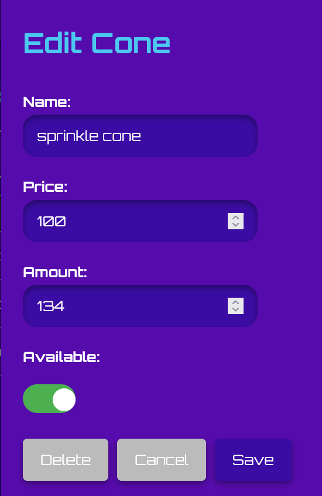
*   It shows the items name, price, current amount and availability. Change any or all of these as desired.
*   Along the bottom, there are three buttons.  
    *   The left button will delete the item. Take care to only use this when you are sure, as it can't be undone. 
    *   The middle button is a cancel button that will return you to the inventory page.
    *   The right button is the save button. Once you've made any desired changes, click this button, and the changes will be saved, and will appear in the inventory table.

## Restocking Items 
*   To make a restock order, navigate to the item table where you would like to restock.
*   On the left of each item in the table is a checkbox, shown below in the left circle. Check all items you would like to restock
*   Once you've selected everything, click the "Restock" button below the table, also circled below. This will pull up a new menu.

*   In this menu, there is an entry for each item that was selected. Input the amount you would like to order in each corresponding input box.
*   Below these rows, there are two buttons,
    *   The "Cancel" button, that will return to the inventory page.
    *   The "Submit" button, that will place the restock order for you.
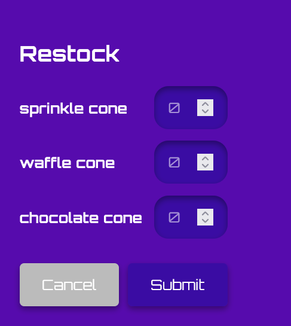
*   You can view both current and past restock orders by clicking the "Past Orders" button, shown below
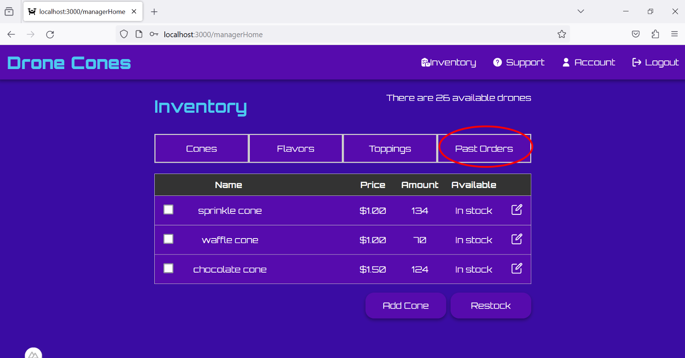
*   This page will show the relevant information for all orders you've made including
    *   The date the order was placed
    *   The item that was ordered
    *   The amount that was ordered
    *   The order status.
*   Order status has four different statuses
    *   "placed" when the order has been placed, but not yet shipped.
    *   "shipped" once the order has been sent out for delivery.
    *   "completed" once you have recieved the order.
    *   "canceled" if the order was canceled for any reason.
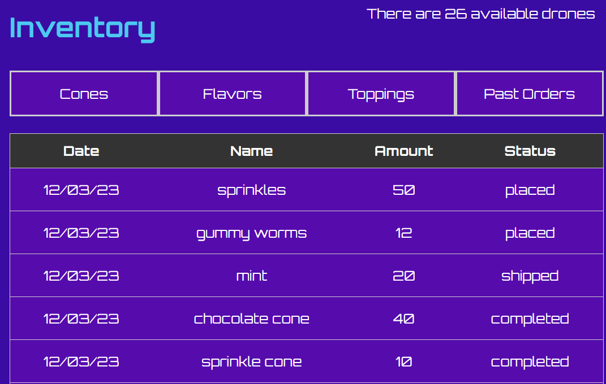
## Revenue Graphs
*   Go to the account information page to view revenue graphs and bank information

<br>
<br>
<br>

# The Order Page

## Creating an Order
* Once logged in, if you are a regular user and not a drone owner or manager, you will be directed to the Ordering page.
* The Ordering page can also be accessed through the navigation bar at the top of the page.
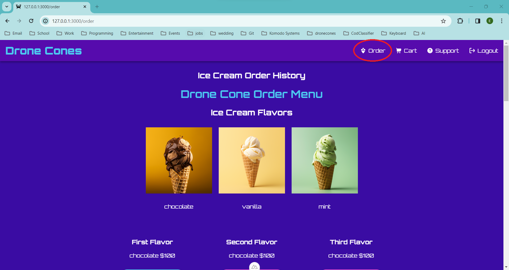 
* From the ordering page, we can then fill out an order by choosing ice cream flavors, cone, and toppings.
* If a button for a flavor/topping/cone is pink, this would indicate that either an item is out of stock or (in the case of scoops) you have yet to choose a first or second flavor of ice cream. In order to choose a second or third ice cream scoop, you must choose a first and second scoop.
 
* There is also an option if you accidentally chose a second or third flavor and decide you do not want a second or third flavor to remove those scoops from your order. If you press the second flavor's "No Second Scoop" button, this will result in clearing the Second and Third flavor from your order
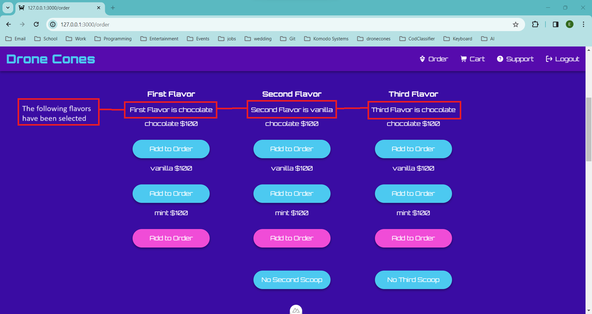 
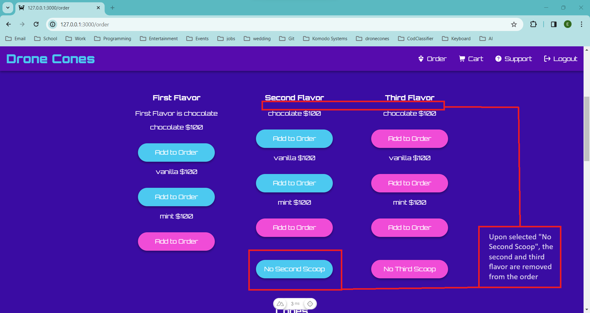 
* The user can pick 1 to 3 scoops for their ice cream cone in any flavors that are available (indicated by blue buttons).
 
* Once ice cream scoops have been selected, you are able to add a cone and topping. The cone and the First flavor of ice cream are the only requirements for creating an order, while the Second and Third flavor as well as the topping are optional.
* The cone and topping can be selected in the same way as the First scoop of ice cream, by selecting the "Add to Order" button below the name of the cone or topping.
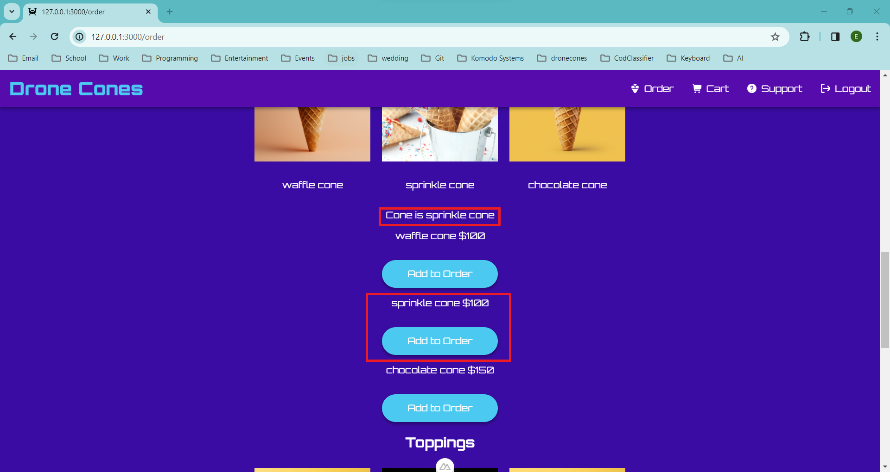 
 
* If a first scoop of ice cream or a cone has not been selected, the "Add to Cart" button will remain pink (unable to add order to cart) until both are selected. Once they have been selected, the button will turn blue and you may add your order to the cart.
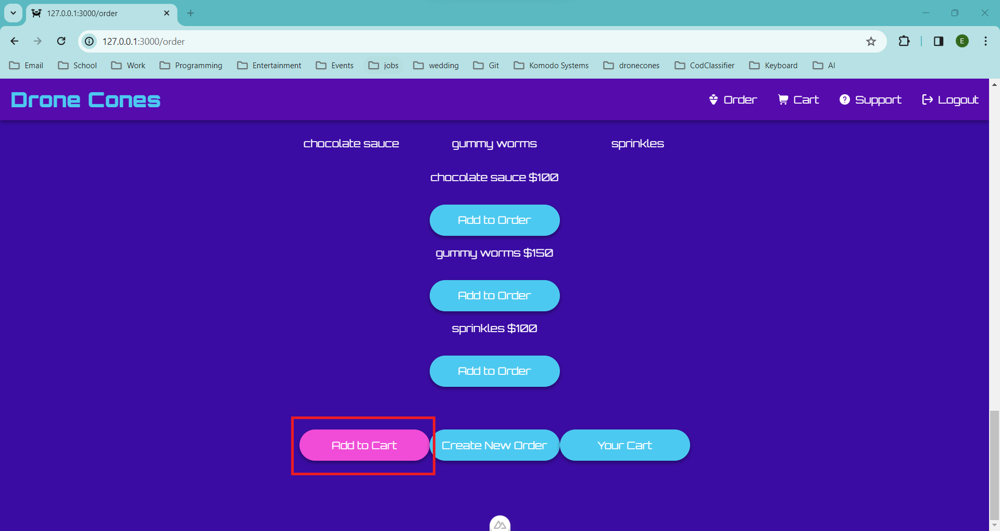
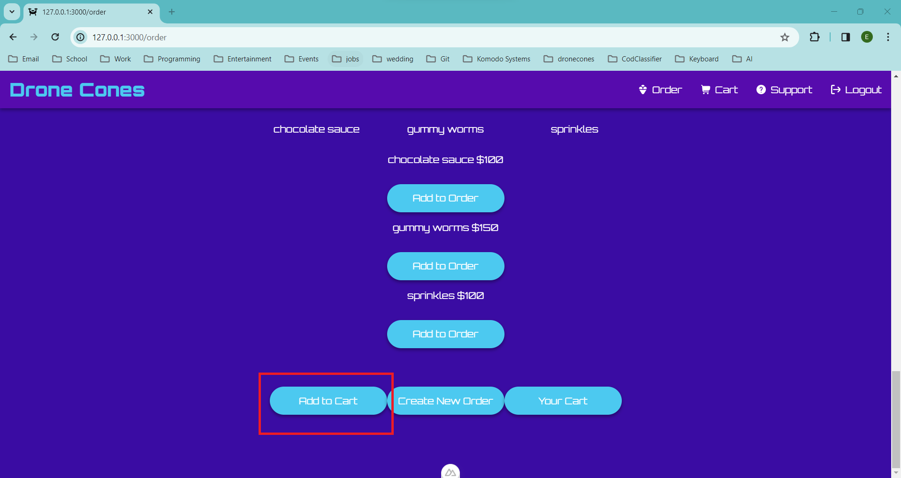  
* To view the cart and complete the transaction you may press the "Your Cart" button at the bottom of the page or the "Cart" button in the Navigation bar at the top of the page.
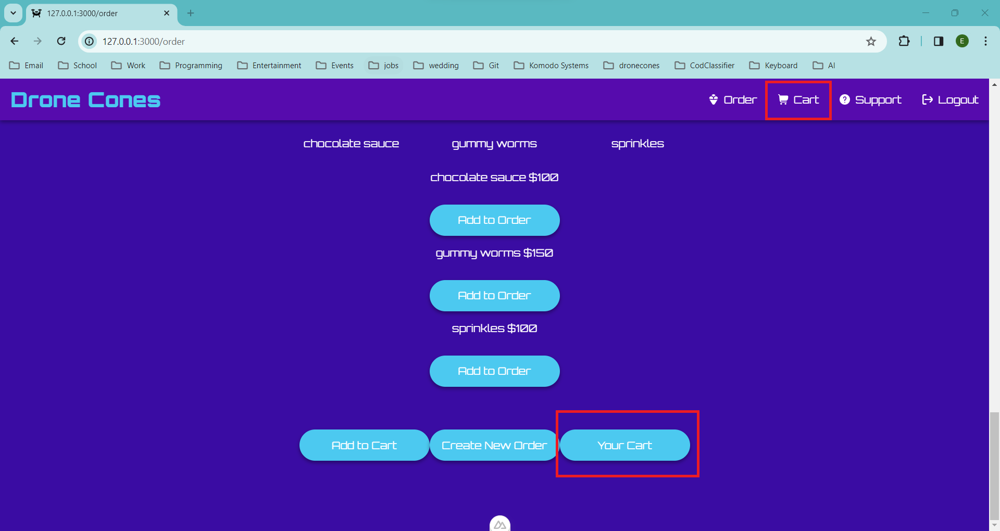 
* If you would like to make another order, you can press the "Create New Order" button at the bottom of the Ordering page or the "Order" button in the Navigation bar at the top of the page.
 
* If you would like to order a from a recent past order, you can select one of the past orders at the top of the page.
 

<br>
<br>
<br>

# Troubleshooting

## Login Page
## When I register my account, I am not getting a confirmation email about it?
Wait a few minutes…It’s been known to take up to 20 minutes for the email to send.


## Order page
## When I try to add a flavor, cone type, or topping it doesn’t add?
Check the color of the “add to order” button. It will appear pink if the item requested is out of stock.
## I want order multiple cones in one transaction with different attributes, but the cone specifications stay the same when I add the first one to the cart?
Click “Create New Order” button to refresh the specifications. The previous cone added to the cart will remain in the cart until deleted from the cart page itself.

## Drones page
## I want to remove my drone from your system but there is no delete button?
Click the Edit button for the drone to be removed. Change the status to delete and click save to delete.
## Why doesn’t it work when I change the drone information?
Try waiting a couple more seconds before saving the new updated drone information. Editing drones in a few seconds can sometimes not allow for the computer to know what is happening. 


# Frequently Asked Questions

## My order wasn't correct/ I never received it. How do I get a refund?
You can fill out a form on the support page and we will look into it and issue a refund

## Can I cancel my order after placing it
Unfortunately, once you place your order, there is no way to cancel it.

## I forgot my password. Can I recover it?
At this time, there is no password reset option. Please email us at support@dronecones.com and we will help you to get your password.  
NOTE: This is not an actual email. Only for demo purposes

## If I am a drone owner and a customer, do I have to make 2 separate accounts?
Yes. You will have to make a drone owner account and a customer account.

## I don't want my drone to be used for deliveries today. Do I have to delete it and readd it later?
On your account page, you can click to edit the drone. In that editing menu, there is an option to disable it for delivery. Whenever you want to use it again, you can go back to the same page and enable it. See [Drone owners](#editing-a-drone) section of manual for more info

## How big are the drone sizes?
A small drone can carry one cone. A medium drone can carry up to two cones. A large drone can carry up to four.

# Contact Information
To get in contact with us, you can fill out a form on the support page (best option), or email us at support@dronecones.com.
